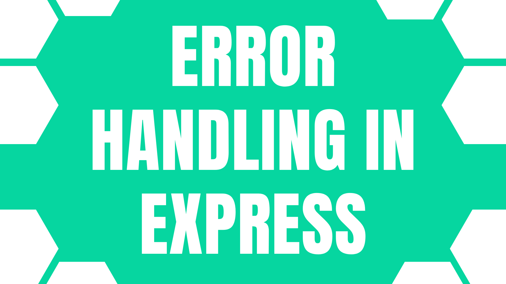

# Error Handling in express

This repository contains sample code on how to do error handling with the Node.js [express](https://expressjs.com/) framework.

<h3 align="center">Please help this repo with a ⭐️ if you find it useful! 😁</h3>

This repository is part of the [Error Handling in express](https://youtu.be/DyqVqaf1KnA) tutorial provided by [productioncoder.com](https://productioncoder.com/).

[](https://youtu.be/DyqVqaf1KnA)

For updates, please reach out to [@productioncoder](https://twitter.com/productioncoder) on Twitter.

## Session implementation with express.js and express-session

This repository illustrates how to handle expected errors in a DRY way in express and how to not expose any internal structure in case of unexpected errors.

## Running this project

Run

```
npm install
```

to install the project's dependencies.

Execute the `dev` script to start up your server.

```
npm run dev
```

## API

### POST /tweet

Expected payload

```
{
    "msg": "my tweet message"
}
```
